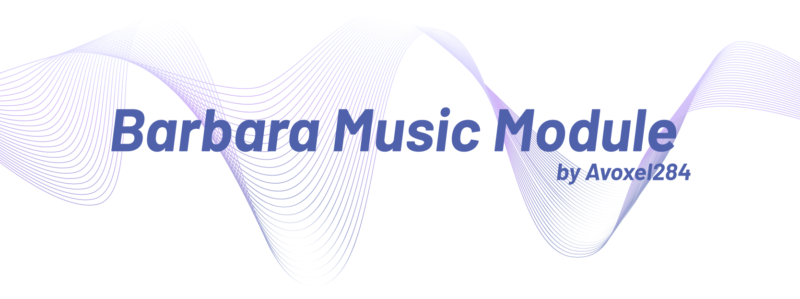

<b>[Documentation](https://avoxel284.github.io/barbara) | [Examples](https://github.com/Avoxel284/barbara/examples)</b>

## WORK IN PROGRESS!

Library is in development, use at your own risk.

<br>
<br>

## About

In the past, I coded a Discord bot named norikobot which used [play-dl](https://github.com/play-dl/play-dl). However, while play-dl was a great library for streaming music, it was archived and is no longer maintained. Thus, I created Barbara Music. Barbara features a unified `MusicTrack` class with intuitive methods and properties to stream audio. Barbara was built with music-playing Discord bots in mind, especially as I use it for one of my own Discord bots, norikobot.

Since Barbara Music uses Prism Media, Barbara creates a Prism FFmpeg object that can be used as a DiscordVoice audio resource. Because of this, audio filters can be added by passing extra arguments to FFmpeg.

Currently Barbara only streams from SoundCloud, however other services are planned.

## Installation

```
npm install barbara-music
```

## Examples

```js
const barbara = require("barbara-music");

barbara.searchTrack("never gonna give you up", barbara.yt).then(async (track) => {
	const resource = discordVoice.createAudioResource(await track.sing());
});
```

<br>
don't ask why i picked a genshin character as the name
